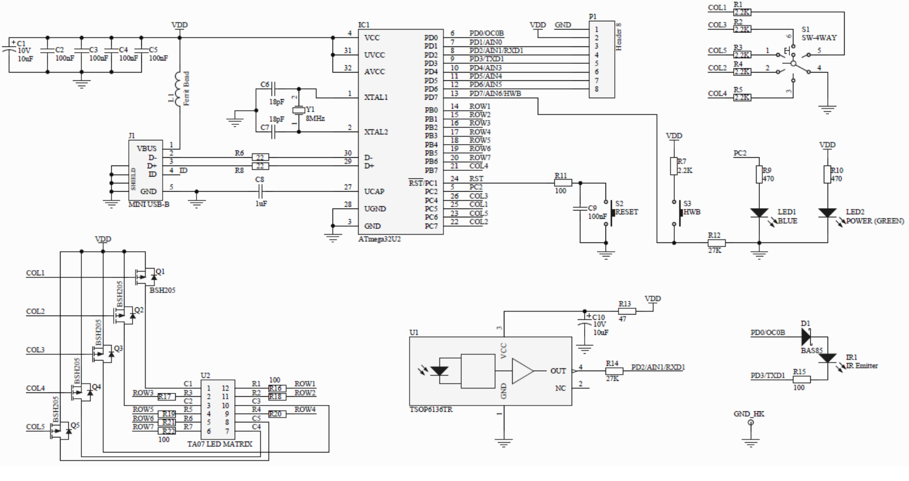

# Paper, Scissors, Rock, Spock, Lizard

## Description
This game is an extended version of the classic Rock-Paper-Scissors. In this version, two additional choices are added: Spock and Lizard. The rules are based on how each element interacts with the others, creating a fun, strategic twist on the original game.

## How to Play
1. **Players**: The game can be played between two players or a player vs the computer.
2. **Choices**: Each player selects one of the five options:
   - **Rock** (crushes Scissors, crushes Lizard)
   - **Paper** (covers Rock, disproves Spock)
   - **Scissors** (cuts Paper, decapitates Lizard)
   - **Spock** (smashes Scissors, vaporizes Rock)
   - **Lizard** (eats Paper, poisons Spock)

3. **Winning**: The outcome is determined by comparing both choices based on the rules:
   - Rock crushes Scissors
   - Rock crushes Lizard
   - Paper covers Rock
   - Paper disproves Spock
   - Scissors cuts Paper
   - Scissors decapitates Lizard
   - Spock smashes Scissors
   - Spock vaporizes Rock
   - Lizard eats Paper
   - Lizard poisons Spock

4. **Scoring**: After each round, the winner is awarded a point, and a draw results in no points for either player.

5. **Game End**: The game continues until round three.

## Player Perspective
In this game, you are always Player 1 (P1), and your opponent is always Player 2 (P2).

- **From your perspective (P1)**: If you win, P1 will win, and P2 will lose. If you lose, P1 will lose, and P2 will win.
- **From the opponent's perspective (P2)**: The roles are reversed. If they win, P2 will win, and P1 will lose. If they lose, P2 will lose, and P1 will win.

